# See You Again

## 우리 동네 안심 물품 대여 서비스

#### 🕛 기간
2023.04.10 ~ 2023.05.19

[ 목차 ]
1. 서비스 개요
2. 주요 기능 소개
3. 기술 스택
4. 아키텍처
5. ERD
6. 서비스 소개
7. 참여자

## 🔎 서비스 개요
닌텐도 스위치 구매 전, 한 번 체험해 보고 싶으신 적 있으셨나요?

여행 갈 때만 쓰고 싶은데 평소엔 잘 쓰지 않아 구입을 망설인 제품이 있으신가요?

필요한 물건을 쉽고 빠르게 대여할 수 있는 우리 동네 안심 물품 대여 서비스, See You Again 입니다.

## 🛠️ 주요 기능 소개 

- 물품 대여 : 잠깐 필요한데 사기엔 부담스러운 물품을 대여
- 안전 구역 추천 : 경찰서, cctv, 가로등 위치 데이터를 기반으로 거래하기 안전한 장소 추천
- 실시간 위치 공유 : 물품 대여나 반납 시 서로 헤매지 않도록 실시간 위치 공유
- 실시간 채팅 : 대여 예약이나 장소 변경, 약속 시간 등을 정하기 쉽도록 실시간 채팅 기능 제공

## 🔧 기술 스택

- **FrontEnd**
    - Visual Studio Code
    - Node.js : 9.4.1
    - react : 18.2.0
    - react-dom : 18.2.0
    - react-hook-form : ^7.43.9
    - recoil : ^0.7.7
    - husky : ^8.0.3
    - eslint : ^8.38.0
    - prettier : 2.8.7
    - tailwindcss : ^3.3.1
    - axios : ^1.3.6
    - next-pwa : ^5.6.0
    - firebase : 9.22.0
    - stompjs : 2.3.5
    - sockjs-client : 1.5.1
- **BackEnd**
    - IntelliJ
    - OpenJDK 11
    - Gradle : 7.6.1
    - SpringBoot v2.7.9
    - SpringCloud : 2021.0.6
        - Netflix Eureka Service (Discovery Service)
        - API Gateway
    - Spring Security : 2.7.10
    - Kafka : 3.1.2
    - Websocket : 2.3.3
    - firebase : 9.1.1
- **CI/CD**
    - AWS EC2
    - Docker
        - Bridge Network
    - Jenkins
        - Pipeline
- **협업 툴**
    - Git Lab
    - Jira
    - Mattermost
    - Discord
    - Notion
- **DB**
    - MySQL
    - Redis

## 📦 아키텍처
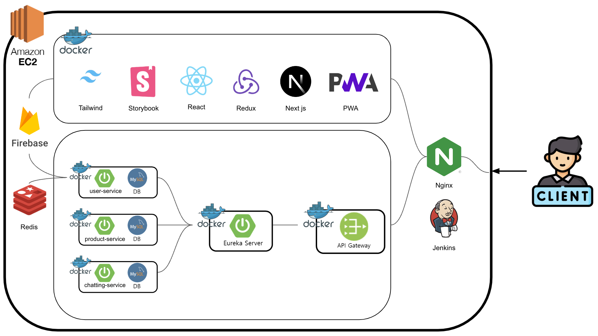

## 🕸️ ERD

### 유저 서비스 ERD
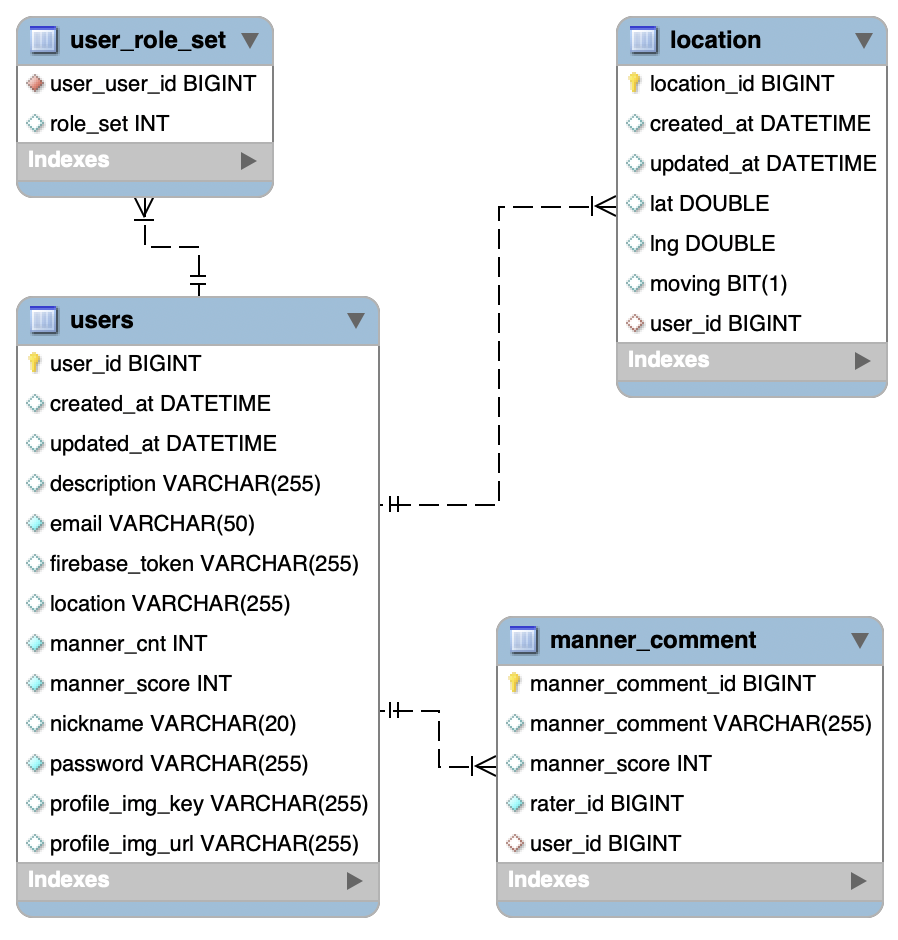

### 대여 물품 서비스 ERD

### 채팅 서비스 ERD
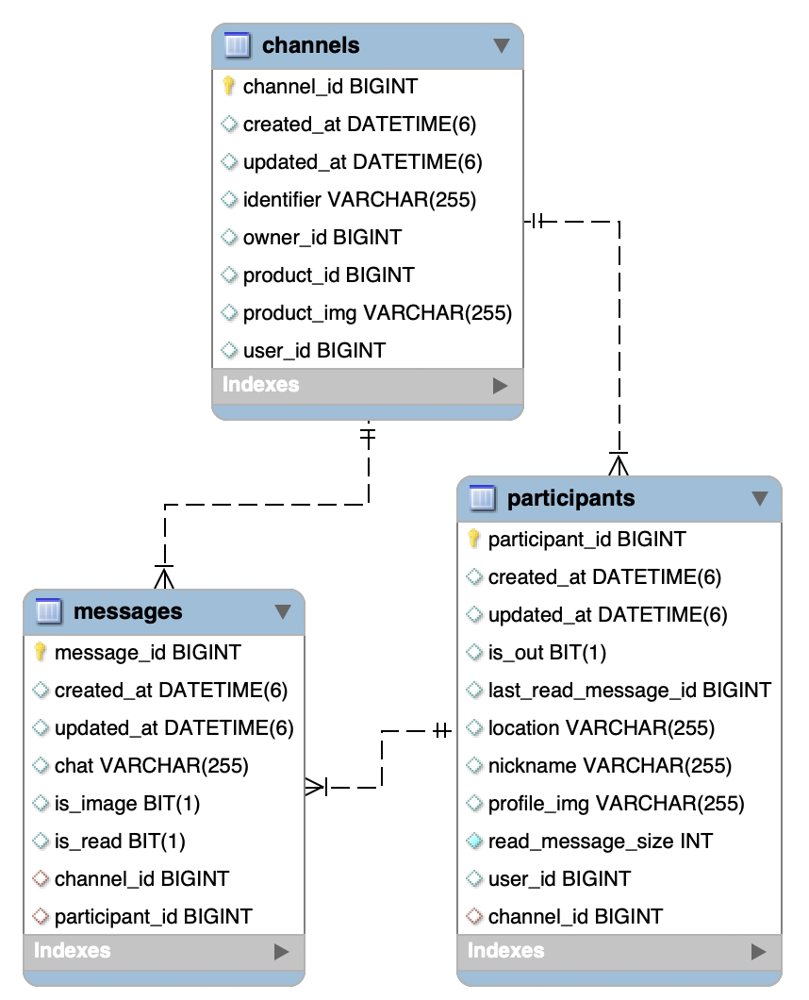

## 💻 피그마
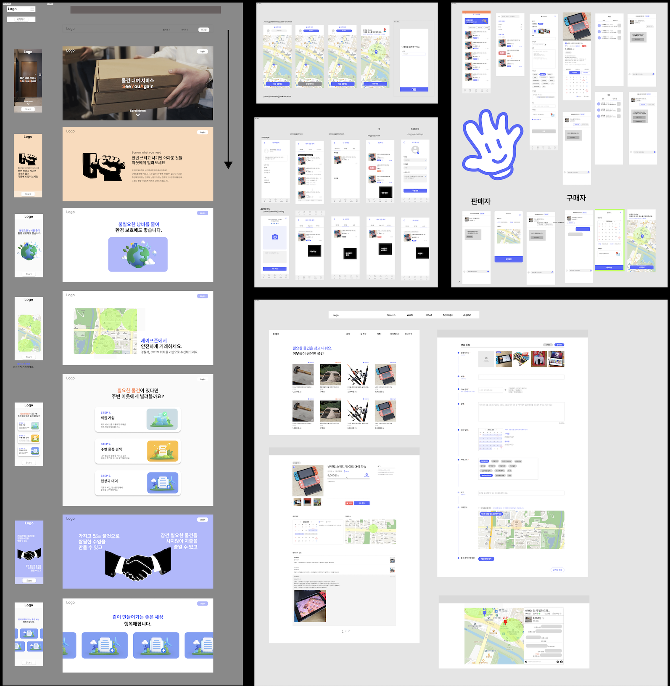

## 📺 서비스 소개 (화면)

### PWA 반응형 비교
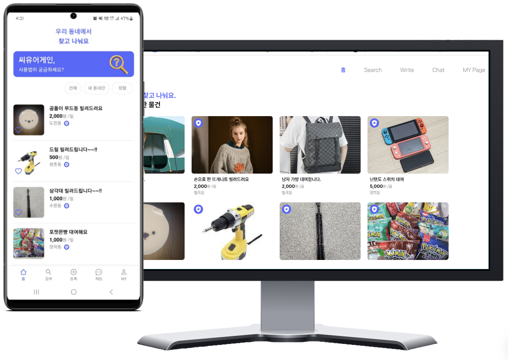

### 로그인 페이지

### 메인 페이지 & 디테일 페이지
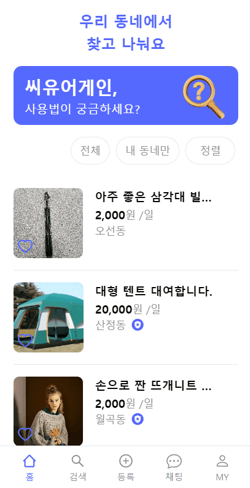

### 상품 등록
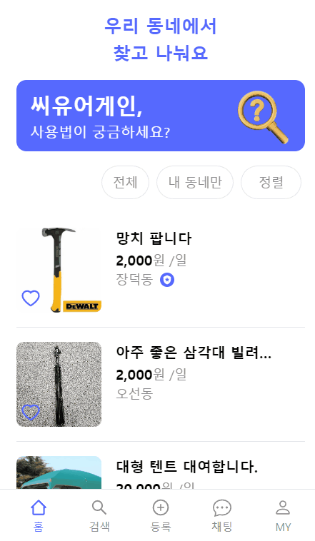

### 프로필 수정
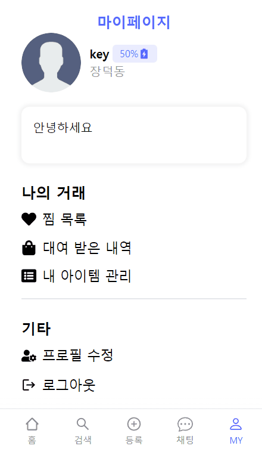

### 예약 기능
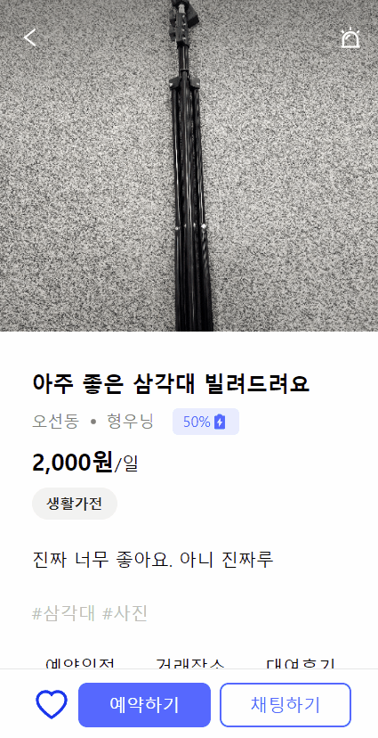

### 실시간 채팅
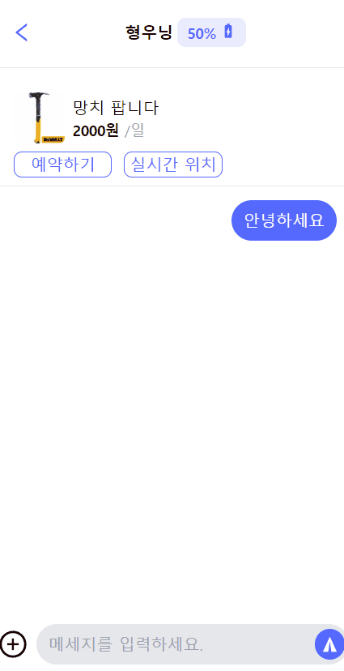

### 실시간 위치 공유
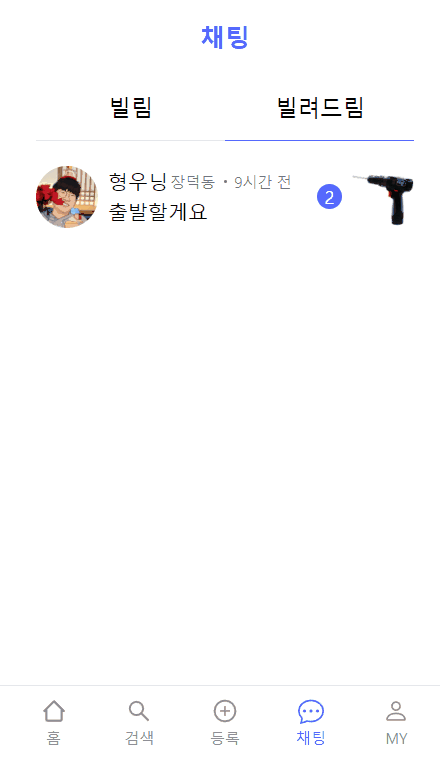

## 👤 참여자 - 역할

|                        김기윤(팀장)                        |                       최형운                       |                     김예은                       |                     나웅기                       |                  오성훈                       |                  고대석                      |
| :----------------------------------------------------------: | :-------------------------------------------------------: | :-----------------------------------------------------: | :-----------------------------------------------------: | :-----------------------------------------------------: | :-----------------------------------------------------: |
|  |  |  |  | | |
|       [Keeeeeey](https://github.com/Keeeeeey)        |         [choihyoingwoon](https://github.com/choihyoingwoon)         |          [yeni28](https://github.com/yeni28)          |          [WoongKi1115](https://github.com/WoongKi1115)          |     [OctoHun](https://github.com/OctoHun)          |     [junalina](https://github.com/junalina)          |
|                         Web BackEnd & FrontEnd & CI-CD                          |                       Web FrontEnd & CI-CD & UI/UX                        |                       Web FrontEnd & CI-CD  & UCC & PPT                     |                      Web BackEnd & FrontEnd & CI-CD                       |                 Web FrontEnd & CI-CD                       |             Web BackEnd & CI-CD                       |
